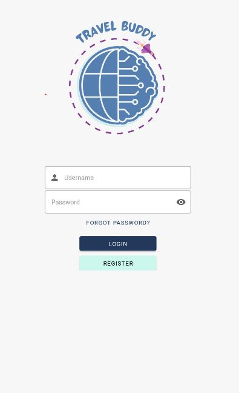

# TravelBuddy
## Senior Project for B.S. Software Engineering 
### San Jose State University
#### Authored By: Liz Huelfenhaus, Anh Quang Chu, Jowyl Ong, and Bernadette Davoud

This project acts a a "travel buddy" by allowing the user to search and book flights and hotels. We have also added a chatbot assistant for the user to interact with Chat-GPT

This project is for educational purposes and is not intended to serve as an actual platform for travel.

## Travel Buddy Installation guide

#### 1. Clone the project from our github repository (Skip this step if you have the file downloaded)
https://github.com/lshuelfenhaus/travelbuddy

#### 2. Install Node.js (Skip if you have this on your machine)
https://nodejs.org/en/download

#### 3. From the root of project folder (usually travel buddy) in the terminal or command line, install all packages and dependecies
run command: npm install

#### 4. Install Expo Go app on android or iOS devices
iOS app store: https://apps.apple.com/us/app/expo-go/id982107779
Android Google Play: https://play.google.com/store/apps/details?id=host.exp.exponent

#### 5. Deploy the app to Expo local server in the same terminal
run command: npx expo start

#### 6. Launch the app on a mobile device
Scan the QR code or enter the server address displayed on the terminal after running npx expo start to launch the app

#### 7. Sign up a user then sign in to start using the app
